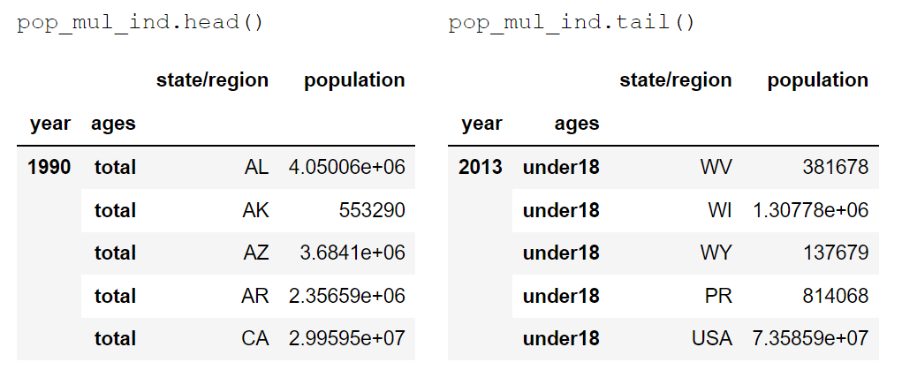

# DS Project Example

## Introduction

## Data Selection




[Reference1](https://github.com/memoatwit/dsexample)
## Methods
- method 1
  - method 1.1
  - method 1.2
  - method 1.3
- method 2
  - method 2.1
  - method 2.2
## Results

By code `pd.merge()`
## Discussion
```
Warning ...
```

## Summary

## Reference
