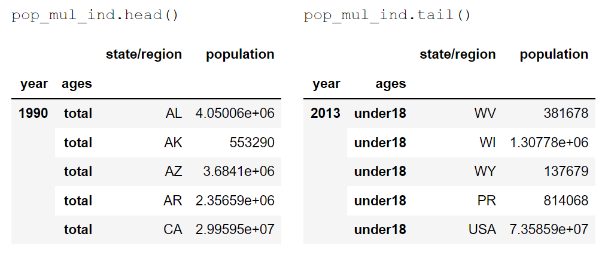

# DS Project Example

## Introduction

### Title

## Data Selection




## Methods
- method 1
  - Method 1.1
    - Method 1.1.1
    - Method 1.1.2
  
  Explanation of 
  - method 1.2
  - method 1.3
- method 2
  - method 2.1
  - method 2.2
## Results

By code `pd.merge()` ''''''
## Discussion
```
Warning geageageagea...
```

## Summary
In this project, I .... 

## Reference

[Reference1](https://github.com/memoatwit/dsexample)
